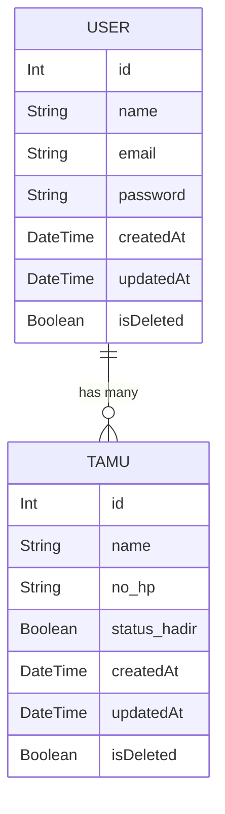

# Undangan Tamu Backend

Praktik web development kelas Bootcamp Kilat GDGoC Universitas Gunadarma.

## API Endpoints

- `POST /api/auth/signup` - Register admin
- `POST /api/auth/signin` - Login admin
- `GET /api/tamu` - Ambil semua data tamu (butuh bearer token)
- `POST /api/tamu` - Buat data tamu baru (butuh bearer token)
- `PUT /api/tamu/<id>` - Update data tamu (butuh bearer token)
- `PATCH /api/tamu/<id> - Hapus data tamu (butuh bearer token)

## Jalankan program

### Prerequisites

- Node.js v22+
- Prisma @prisma/client

### Instal

1. Clone repo:

```sh
git clone https://github.com/DimKFPS/bootcamp-kilat
```

2. Pergi ke folder repo:

```sh
cd bootcamp-kilat
```

3. Instal dependencies:

```sh
npm i
```

### Database Setup

#### ERD



1. Migrate prisma database:

```sh
npx prisma migrate dev
```

### Jalankan server backend

1. Start the development server:

```sh
npm run dev
```
